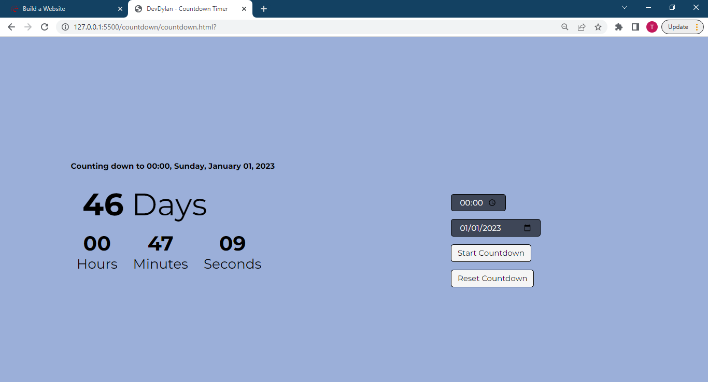

# Countdown Timer

## Description

Simple app that counts down to any time specified by the user.

View [Live Site](https://dev-dylann.github.io/countdown-timer/)

## Features

- Continues to countdown even when the window is minimized or closed
- Allows user's to reset an already counting countdown
- Light/Dark theme based on user's OS theme

## Usage

- Select the time and day you would like to countdown to
- Click "Start Countdown" to start the timer
- Click "Reset Countdown" to reset the timer

## Screenshot

## Built With

- Semantic HTML5 markup
- CSS3
- Vanilla JavaScript
- Mobile-first workflow
- Font from [Google Fonts](https://fonts.google.com)
